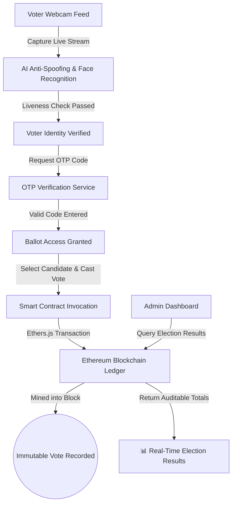

<div align="center">

# 🤖 AI-Integrated Decentralized E-Voting System

[](https://react.dev/)
[](https://nextjs.org/)
[](https://soliditylang.org/)
[](https://hardhat.org/)
[]()
[](https://opensource.org/licenses/MIT)

**A secure, biometric-enabled electronic voting platform combining AI-driven Face Recognition & Anti-Spoofing detection with Ethereum Smart Contracts (Solidity, Hardhat, Ethers.js) for tamper-proof ballot recording.**

[Live Demo App](https://bhavanagangavaram.github.io/AI-Integrated-Decentalized-E-Voting-System/) · [Live Repository](https://github.com/bhavanagangavaram/AI-Integrated-Decentalized-E-Voting-System) · [Report Bug](https://github.com/bhavanagangavaram/AI-Integrated-Decentalized-E-Voting-System/issues)

</div>

---

## ⚡ Executive Summary

The **AI-Integrated Decentralized E-Voting System** is a next-generation electronic voting solution designed to eliminate voter impersonation and election fraud. It enforces dual-layer security:
1. **AI Biometric Authentication**: WebCam facial recognition with anti-spoofing liveness detection (`face-api.js`, TensorFlow models) to verify voter identity prior to ballot issuance.
2. **Blockchain Decentralized Ledger**: Immutable ballot casting via Solidity Smart Contracts deployed on an Ethereum ledger, ensuring votes cannot be tampered with or retroactively altered.

---

## 🔑 Key Features

- 👤 **AI Face Recognition & Anti-Spoofing** — Biometric voter verification using `face-api.js` facial landmarks and anti-spoofing detection.
- ⛓️ **Ethereum Smart Contract Ledger** — Votes are recorded as immutable transactions on smart contracts, ensuring zero single point of failure.
- 🔐 **Multi-Factor Auth & OTP Security** — Integrated OTP verification service and Shamir secret key sharing (`secrets.js-grempe`).
- 📊 **Real-Time Election Analytics** — Admin mode dashboard for monitoring live voter turnout, election dates, and audit logs.
- 🌐 **Modern Responsive Web Interface** — Next.js 16 + TailwindCSS frontend with live camera feed integration.

---

## 📐 Architecture & Verification Flow



---

## 📂 Repository Structure

```
AI-Integrated-Decentalized-E-Voting-System/
├── contracts/          # Solidity smart contracts & Hardhat deploy scripts
├── frontend/           # Next.js 16 + React 19 web interface
│   ├── app/            # App router & layout templates
│   ├── components/     # VotingApp, AdminMode & UserMode components
│   └── public/models/  # AI face recognition model weights
├── backend/            # Express, Node API & Python backend services
├── diagrams/           # System architecture, usecase & sequence diagrams
├── figures/            # Workflow & system architecture diagrams
├── docs/               # IEEE research paper & project documentation
└── package.json        # Main project runner script
```

---

## 🚀 Quick Start Guide

### Prerequisites

- **Node.js** >= 18.0.0
- **npm** >= 9.0.0

### Installation & Setup

1. **Clone the Repository**
   ```bash
   git clone https://github.com/bhavanagangavaram/AI-Integrated-Decentalized-E-Voting-System.git
   cd AI-Integrated-Decentalized-E-Voting-System
   ```

2. **Install All Dependencies**
   ```bash
   npm run setup
   ```

3. **Start All Services Concurrently**
   ```bash
   npm start
   ```

4. **Deploy Smart Contracts**
   ```bash
   npm run deploy
   ```

---

## 📄 License

Distributed under the MIT License. See `LICENSE` for more details.

---

## 📬 Contact & Connect

- **Email**: [bhavanagangavaram1@gmail.com](mailto:bhavanagangavaram1@gmail.com)
- **LinkedIn**: [bhavana--g](https://www.linkedin.com/in/bhavana--g/)
- **GitHub**: [@bhavanagangavaram](https://github.com/bhavanagangavaram)

---

<div align="center">
  Developed by <strong><a href="https://github.com/bhavanagangavaram">Bhavana Gangavaram</a></strong>
</div>
