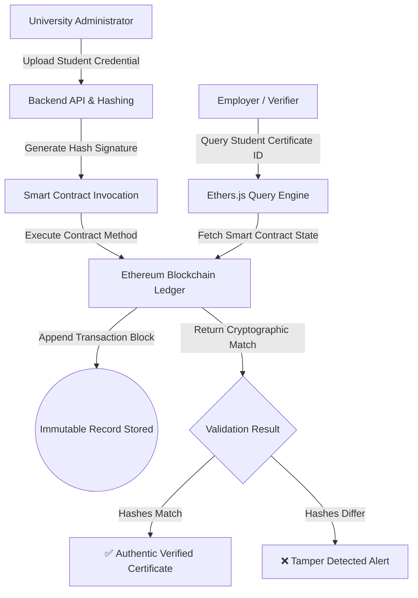

# 🎓 EduCredential Blockchain

[](https://soliditylang.org/)
[](https://hardhat.org/)
[](https://docs.ethers.org/)
[](https://nodejs.org/)
[](https://opensource.org/licenses/MIT)

**A decentralized, tamper-proof educational credential verification platform powered by Ethereum Smart Contracts (Solidity & Hardhat), Node.js, and Ethers.js for immutable academic record storage and real-time verification.**

---

## ⚡ Executive Summary

**EduCredential Blockchain** solves the problem of academic certificate forgery by publishing student degree metadata and cryptographic hashes onto a decentralized Ethereum blockchain network. Once mined into a block, academic credentials cannot be modified, backdated, or falsified. Employers and academic institutions can verify certificate authenticity instantly via a web dashboard.

---

## 🔑 Key Features

- ⛓️ **Decentralized Ledger** — Smart contract state storage ensuring zero single point of failure or record tampering.
- 🔐 **Cryptographic Proofs** — Hashing of certificate payloads (student ID, institution code, degree major, graduation date) via SHA-256 / Keccak-256.
- 📜 **Smart Contract Architecture** — Solidity smart contracts deployed via Hardhat local node / testnets.
- 🌐 **Full-Stack Web Interface** — Interactive React / Node.js dashboard connected via Ethers.js for issuing and validating credentials.
- 🔑 **Multi-Factor OTP Security** — Integrated OTP verification service for credential request authorization.

---

## 📐 Architecture & Verification Flow



---

## 📂 Repository Structure

```
EduCredentialBlockchain/
├── contracts/          # Solidity smart contracts & Hardhat deploy scripts
├── frontend/           # Web interface dashboard
├── backend/            # Express / Node.js API services
├── scripts/            # Deployment & data seeding scripts
├── diagrams/           # System architecture & flow charts
└── package.json        # Main project runner script
```

---

## 🚀 Quick Start Guide

### Prerequisites

- **Node.js** >= 18.0.0
- **npm** >= 9.0.0

### Installation & Setup

1. **Clone the Repository**
   ```bash
   git clone https://github.com/bhavanagangavaram/EduCredentialBlockchain.git
   cd EduCredentialBlockchain
   ```

2. **Install All Dependencies**
   ```bash
   npm run setup
   ```

3. **Start Local Blockchain & Services**
   ```bash
   # Starts local Hardhat node, backend, OTP service, and frontend concurrently
   npm start
   ```

4. **Deploy Smart Contracts**
   ```bash
   npm run deploy
   ```

---

## 📄 License

Distributed under the MIT License. See `LICENSE` for more details.

---

## 📬 Contact & Connect

- **Email**: [bhavanagangavaram1@gmail.com](mailto:bhavanagangavaram1@gmail.com)
- **LinkedIn**: [bhavana--g](https://www.linkedin.com/in/bhavana--g/)
- **GitHub**: [@bhavanagangavaram](https://github.com/bhavanagangavaram)

---

<div align="center">
  Developed by <strong><a href="https://github.com/bhavanagangavaram">Bhavana Gangavaram</a></strong>
</div>
